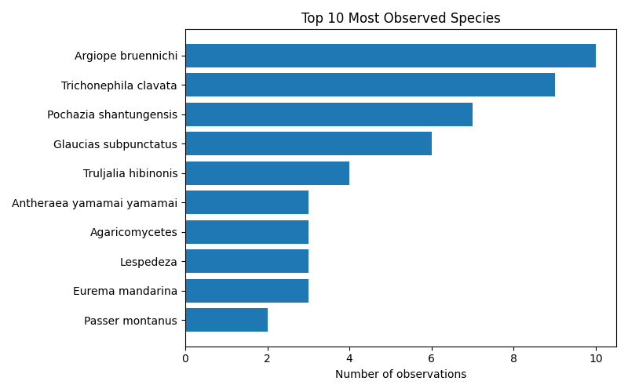

# Introduction

As part of the DBCLS BioHackathon 2025, we here report the results of the Wikiblitz we ran during the event. It builds on the initial edition held at the previous edition of the biohackathon in Fukushima. During that edition we reported on how to run a Wikiblitz, which is an event where iNaturalist is used to identify the flora and fauna of the surroundings of event. We ran this edition using the steps described [@usesMethodIn:waagmeester2025biohackjp24]

# Methods
## iNaturalist project
We created a project in iNaturalist [@mason2025inaturalist], (https://www.inaturalist.org/projects/biohackathon-2025). iNaturalist is an app and communicate that allows recording observation of organisms. The observations can be assessed using a machine-learning model. Those suggestions are subsequentelly assessed by members of the global iNaturalist community. An iNaturalist project is a way to collect and organise a group of observations. Observations collected in a group and its annotations can than be automatically integrated in other pipelines. 

## Wikidata
Wikidata is the linked-data repository of the Wikimedia Foundation that seamlessly integrates with all language versions of Wikipedia. Wikidata contains data on taxa. Often those taxa in Wikidata contain mappings to external identifiers of which one is the iNaturalist identifier. These mappings allow linking those observations through its species identifier to other information source on the taxa observed. Wikidata has a SPARQL endpoint which we have used to align the biohackathon iNaturalist project with Wikidata. 

## Wikipedia
A major goal of this wikiblitz is to identify missing Wikipedia articles in the languages spoken by those who participated in the WikiBlitz. These are English, Japanese, Spanish, Arabic and Dutch. However, the pipeline can be extended to any of the language version of Wikipedia. 

## Github actions. 
Github actions is a contiuous integration platform that is intended to run tests on code changes. However, it can also be used to run any code. We have build a python script that compares all observations on a given iNaturalist project with existing articles on Wikipedia. This through the mappings in Wikidata. The script is initiated by isssueing a github issue, which triggers a github action we have build for this purpose. The results are stored as a markdown file in the repository.
For this specific wikiblitz the results are published below. 
# Results
## iNaturalist Project Report: biohackathon-2025

- Total observations: 198
- Unique species observed: 147
- Unique observers: 8

## Wikipedia & Wikidata Coverage

- Species not on Wikidata: **8**
- Missing in en: **37**

- Missing in es: **76**

- Missing in ja: **76**

- Missing in ar: **96**

- Missing in nl: **56**

| Taxon | Wikidata | EN | ES | JA | AR | NL |
|---|---|---|---|---|---|---|
| Aiolopus thalassinus tamulus | + | - | - |- | - | - |
| Anatherum virginicum | + | - | - | - | - | - |
| Argiopinae | + | - | - | - | - | - |
| Corvus macrorhynchos japonensis | + | - | - | - | - | - |
| Danielithosia immaculata | + | - | - | - | - | - |
| Fomitopsis dickinsii | + | - | - | - | - | - |
| Gymnopilus orientispectabilis | + | - | - | - | - | - |
| Laspeyria ruficeps | + | - | - | - | - | - |
| Monticola solitarius philippensis | + | - | - | - | - | - |
| Papilio agenor | + | - | - | - | - | - |
| Pelagodes antiquadraria | + | - | - | - | - | - |
| Rusicada privata | + | - | - | - | - | - |
| Spiralisigna subpumilata | + | - | - | - | - | - |
| Thelypteridoideae | + | - | - | - | - | - |
| Acromegalomma | + | [+](https://en.wikipedia.org/wiki/Acromegalomma) | - | - | - | - |
| Boletellus emodensis | + | [+](https://en.wikipedia.org/wiki/Boletellus_emodensis) | - | - | - | - |
| Chlaenius posticalis | + | - | - | - | - | [+](https://nl.wikipedia.org/wiki/Chlaenius_posticalis) |
| Eurema mandarina | + | [+](https://en.wikipedia.org/wiki/Eurema_mandarina) | - | - | - | - |
| Glaucias subpunctatus | + | - | - | [+](https://ja.wikipedia.org/wiki/%E3%83%84%E3%83%A4%E3%82%A2%E3%82%AA%E3%82%AB%E3%83%A1%E3%83%A0%E3%82%B7) | - | - |
| Lepisorus thunbergianus | + | - | - | [+](https://ja.wikipedia.org/wiki/%E3%83%8E%E3%82%AD%E3%82%B7%E3%83%8E%E3%83%96) | - | - |
| Leptocorisa chinensis | + | - | - | [+](https://ja.wikipedia.org/wiki/%E3%82%AF%E3%83%A2%E3%83%98%E3%83%AA%E3%82%AB%E3%83%A1%E3%83%A0%E3%82%B7) | - | - |
| Loxoblemmus arietulus | + | - | - | - | - | [+](https://nl.wikipedia.org/wiki/Loxoblemmus_arietulus) |
| Motacilla alba lugens | + | - | - | [+](https://ja.wikipedia.org/wiki/%E3%83%8F%E3%82%AF%E3%82%BB%E3%82%AD%E3%83%AC%E3%82%A4) | - | - |
| Orancistrocerus | + | [+](https://en.wikipedia.org/wiki/Orancistrocerus) | - | - | - | - |
| Physopelta gutta | + | - | - | [+](https://ja.wikipedia.org/wiki/%E3%82%AA%E3%82%AA%E3%83%9B%E3%82%B7%E3%82%AB%E3%83%A1%E3%83%A0%E3%82%B7) | - | - |
| Pochazia shantungensis | + | [+](https://en.wikipedia.org/wiki/Pochazia_shantungensis) | - | - | - | - |
| Pseudagrion pilidorsum | + | - | - | - | - | [+](https://nl.wikipedia.org/wiki/Pseudagrion_pilidorsum) |
| Sicydiinae | + | [+](https://en.wikipedia.org/wiki/Sicydiinae) | - | - | - | - |
| Solidago altissima | + | [+](https://en.wikipedia.org/wiki/Solidago_altissima) | - | - | - | - |
| Spatalia doerriesi | + | - | - | - | - | [+](https://nl.wikipedia.org/wiki/Spatalia_doerriesi) |
| Statilia maculata maculata | + | - | [+](https://es.wikipedia.org/wiki/Statilia_maculata_maculata) | - | - | - |
| Sutorius eximius | + | [+](https://en.wikipedia.org/wiki/Sutorius_eximius) | - | - | - | - |
| Sympetrum eroticum | + | - | - | - | - | [+](https://nl.wikipedia.org/wiki/Sympetrum_eroticum) |
| Trametes cubensis | + | [+](https://en.wikipedia.org/wiki/Trametes_cubensis) | - | - | - | - |
| Acronicta pruinosa | + | [+](https://en.wikipedia.org/wiki/Acronicta_pruinosa) | - | - | - | [+](https://nl.wikipedia.org/wiki/Acronicta_pruinosa) |
| Anthomyzidae | + | [+](https://en.wikipedia.org/wiki/Anthomyzidae) | - | - | - | [+](https://nl.wikipedia.org/wiki/Anthomyzidae) |
| Canarium labiatum | + | [+](https://en.wikipedia.org/wiki/Canarium_labiatum) | - | - | - | [+](https://nl.wikipedia.org/wiki/Canarium_labiatum) |
| Clematis terniflora | + | [+](https://en.wikipedia.org/wiki/Clematis_terniflora) | - | [+](https://ja.wikipedia.org/wiki/%E3%82%BB%E3%83%B3%E3%83%8B%E3%83%B3%E3%82%BD%E3%82%A6) | - | - |
| Cyrtarachne bufo | + | [+](https://en.wikipedia.org/wiki/Cyrtarachne_bufo) | - | - | - | [+](https://nl.wikipedia.org/wiki/Cyrtarachne_bufo) |
| Cyrtarachne inaequalis | + | [+](https://en.wikipedia.org/wiki/Cyrtarachne_inaequalis) | - | - | - | [+](https://nl.wikipedia.org/wiki/Cyrtarachne_inaequalis) |
| Cyrtarachne nagasakiensis | + | [+](https://en.wikipedia.org/wiki/Cyrtarachne_nagasakiensis) | - | - | - | [+](https://nl.wikipedia.org/wiki/Cyrtarachne_nagasakiensis) |
| Gryllini | + | [+](https://en.wikipedia.org/wiki/Gryllini) | - | - | [+](https://ar.wikipedia.org/wiki/%D8%AC%D8%AF%D8%AC%D8%AF%D8%A7%D9%88%D9%8A%D8%A9_%D8%AD%D9%82%D9%8A%D9%82%D9%8A%D8%A9) | - |
| Harpalus griseus | + | [+](https://en.wikipedia.org/wiki/Harpalus_griseus) | - | - | - | [+](https://nl.wikipedia.org/wiki/Kleine_roodpoothalmkruiper) |
| Hemistola veneta | + | - | [+](https://es.wikipedia.org/wiki/Hemistola_veneta) | - | - | [+](https://nl.wikipedia.org/wiki/Hemistola_veneta) |
| Holochlora japonica | + | [+](https://en.wikipedia.org/wiki/Holochlora_japonica) | - | - | - | [+](https://nl.wikipedia.org/wiki/Holochlora_japonica) |
| Hospitalitermes | + | [+](https://en.wikipedia.org/wiki/Hospitalitermes) | [+](https://es.wikipedia.org/wiki/Hospitalitermes) | - | - | - |
| Lespedeza cuneata | + | [+](https://en.wikipedia.org/wiki/Lespedeza_cuneata) | [+](https://es.wikipedia.org/wiki/Lespedeza_cuneata) | - | - | - |
| Oncocera semirubella | + | [+](https://en.wikipedia.org/wiki/Oncocera_semirubella) | - | - | - | [+](https://nl.wikipedia.org/wiki/Prachtmot) |
| Ornebius kanetataki | + | - | - | [+](https://ja.wikipedia.org/wiki/%E3%82%AB%E3%83%8D%E3%82%BF%E3%82%BF%E3%82%AD) | - | [+](https://nl.wikipedia.org/wiki/Ornebius_kanetataki) |
| Phelotrupes | + | [+](https://en.wikipedia.org/wiki/Phelotrupes) | [+](https://es.wikipedia.org/wiki/Phelotrupes) | - | - | - |
| Plestiodon latiscutatus | + | [+](https://en.wikipedia.org/wiki/Plestiodon_latiscutatus) | - | [+](https://ja.wikipedia.org/wiki/%E3%82%AA%E3%82%AB%E3%83%80%E3%83%88%E3%82%AB%E3%82%B2) | - | - |
| Psychostrophia melanargia | + | [+](https://en.wikipedia.org/wiki/Psychostrophia_melanargia) | - | - | - | [+](https://nl.wikipedia.org/wiki/Psychostrophia_melanargia) |
| Sipyloidea chlorotica | + | [+](https://en.wikipedia.org/wiki/Sipyloidea_sipylus) | - | - | - | [+](https://nl.wikipedia.org/wiki/Sipyloidea_sipylus) |
| Tabaninae | + | [+](https://en.wikipedia.org/wiki/Tabaninae) | - | - | [+](https://ar.wikipedia.org/wiki/%D9%86%D8%B9%D8%B1%D8%A7%D9%88%D8%A7%D8%AA) | - |
| Trichonephila clavata | + | [+](https://en.wikipedia.org/wiki/Trichonephila_clavata) | - | - | - | [+](https://nl.wikipedia.org/wiki/Trichonephila_clavata) |
| Truljalia | + | [+](https://en.wikipedia.org/wiki/Truljalia) | - | - | - | [+](https://nl.wikipedia.org/wiki/Truljalia) |
| Truljalia hibinonis | + | - | - | [+](https://ja.wikipedia.org/wiki/%E3%82%A2%E3%82%AA%E3%83%9E%E3%83%84%E3%83%A0%E3%82%B7) | - | [+](https://nl.wikipedia.org/wiki/Truljalia_hibinonis) |
| Yaginumia sia | + | - | - | [+](https://ja.wikipedia.org/wiki/%E3%82%BA%E3%82%B0%E3%83%AD%E3%82%AA%E3%83%8B%E3%82%B0%E3%83%A2) | - | [+](https://nl.wikipedia.org/wiki/Yaginumia_sia) |
| Zeuzera multistrigata | + | [+](https://en.wikipedia.org/wiki/Zeuzera_multistrigata) | - | - | - | [+](https://nl.wikipedia.org/wiki/Zeuzera_multistrigata) |
| Bactra furfurana | + | [+](https://en.wikipedia.org/wiki/Bactra_furfurana) | [+](https://es.wikipedia.org/wiki/Bactra_furfurana) | - | - | [+](https://nl.wikipedia.org/wiki/Getekende_biesbladroller) |
| Boletellus | + | [+](https://en.wikipedia.org/wiki/Boletellus) | [+](https://es.wikipedia.org/wiki/Boletellus) | - | - | [+](https://nl.wikipedia.org/wiki/Boletellus) |
| Camponotus obscuripes | + | [+](https://en.wikipedia.org/wiki/Camponotus_obscuripes) | - | [+](https://ja.wikipedia.org/wiki/%E3%83%A0%E3%83%8D%E3%82%A2%E3%82%AB%E3%82%AA%E3%82%AA%E3%82%A2%E3%83%AA) | - | [+](https://nl.wikipedia.org/wiki/Camponotus_obscuripes) |
| Clerodendrum trichotomum | + | [+](https://en.wikipedia.org/wiki/Clerodendrum_trichotomum) | - | [+](https://ja.wikipedia.org/wiki/%E3%82%AF%E3%82%B5%E3%82%AE) | - | [+](https://nl.wikipedia.org/wiki/Clerodendrum_trichotomum) |
| Culicinae | + | [+](https://en.wikipedia.org/wiki/Culicinae) | [+](https://es.wikipedia.org/wiki/Culicinae) | - | [+](https://ar.wikipedia.org/wiki/%D8%A8%D8%B9%D9%88%D8%B6%D8%A7%D9%88%D8%A7%D8%AA) | - |
| Desmodium paniculatum | + | [+](https://en.wikipedia.org/wiki/Desmodium_paniculatum) | - | [+](https://ja.wikipedia.org/wiki/%E3%82%A2%E3%83%AC%E3%83%81%E3%83%8C%E3%82%B9%E3%83%93%E3%83%88%E3%83%8F%E3%82%AE) | [+](https://ar.wikipedia.org/wiki/%D8%B9%D8%B1%D9%82%D9%8A%D8%B5_%D8%B9%D8%AB%D9%83%D9%88%D9%84%D9%8A) | - |
| Dicranopteris | + | [+](https://en.wikipedia.org/wiki/Dicranopteris) | [+](https://es.wikipedia.org/wiki/Dicranopteris) | - | - | [+](https://nl.wikipedia.org/wiki/Dicranopteris) |
| Emoia atrocostata | + | [+](https://en.wikipedia.org/wiki/Emoia_atrocostata) | [+](https://es.wikipedia.org/wiki/Emoia_atrocostata) | [+](https://ja.wikipedia.org/wiki/%E3%83%9F%E3%83%A4%E3%82%B3%E3%83%88%E3%82%AB%E3%82%B2) | - | - |
| Graptopsaltria nigrofuscata | + | [+](https://en.wikipedia.org/wiki/Graptopsaltria_nigrofuscata) | - | [+](https://ja.wikipedia.org/wiki/%E3%82%A2%E3%83%96%E3%83%A9%E3%82%BC%E3%83%9F) | [+](https://ar.wikipedia.org/wiki/%D8%B2%D9%8A%D8%B2_%D8%A8%D9%86%D9%8A_%D9%83%D8%A8%D9%8A%D8%B1) | - |
| Hasarius adansoni | + | [+](https://en.wikipedia.org/wiki/Hasarius_adansoni) | - | [+](https://ja.wikipedia.org/wiki/%E3%82%A2%E3%83%80%E3%83%B3%E3%82%BD%E3%83%B3%E3%83%8F%E3%82%A8%E3%83%88%E3%83%AA) | - | [+](https://nl.wikipedia.org/wiki/Kasspringspin) |
| Hippobroma longiflora | + | [+](https://en.wikipedia.org/wiki/Hippobroma_longiflora) | [+](https://es.wikipedia.org/wiki/Hippobroma_longiflora) | [+](https://ja.wikipedia.org/wiki/%E3%83%9B%E3%82%B7%E3%82%A2%E3%82%B6%E3%83%9F) | - | - |
| Lepidodactylus lugubris | + | [+](https://en.wikipedia.org/wiki/Lepidodactylus_lugubris) | [+](https://es.wikipedia.org/wiki/Lepidodactylus_lugubris) | - | - | [+](https://nl.wikipedia.org/wiki/Lepidodactylus_lugubris) |
| Linckia laevigata | + | [+](https://en.wikipedia.org/wiki/Linckia_laevigata) | [+](https://es.wikipedia.org/wiki/Linckia_laevigata) | - | - | [+](https://nl.wikipedia.org/wiki/Linckia_laevigata) |
| Meimuna opalifera | + | [+](https://en.wikipedia.org/wiki/Meimuna_opalifera) | - | [+](https://ja.wikipedia.org/wiki/%E3%83%84%E3%82%AF%E3%83%84%E3%82%AF%E3%83%9C%E3%82%A6%E3%82%B7) | [+](https://ar.wikipedia.org/wiki/%D8%B2%D9%8A%D8%B2_%D8%B1%D8%A7%D8%AC%D9%84) | - |
| Neptis pryeri | + | [+](https://en.wikipedia.org/wiki/Neptis_pryeri) | - | [+](https://ja.wikipedia.org/wiki/%E3%83%9B%E3%82%B7%E3%83%9F%E3%82%B9%E3%82%B8) | - | [+](https://nl.wikipedia.org/wiki/Neptis_pryeri) |
| Nyctereutes viverrinus | + | [+](https://en.wikipedia.org/wiki/Japanese_raccoon_dog) | - | - | [+](https://ar.wikipedia.org/wiki/%D9%83%D9%84%D8%A8_%D8%B1%D8%A7%D9%83%D9%88%D9%86%D9%8A_%D9%8A%D8%A7%D8%A8%D8%A7%D9%86%D9%8A) | [+](https://nl.wikipedia.org/wiki/Japanse_wasbeerhond) |
| Oryctes rhinoceros | + | [+](https://en.wikipedia.org/wiki/Oryctes_rhinoceros) | [+](https://es.wikipedia.org/wiki/Oryctes_rhinoceros) | [+](https://ja.wikipedia.org/wiki/%E3%82%B5%E3%82%A4%E3%82%AB%E3%83%96%E3%83%88) | - | - |
| Parapediasia teterrellus | + | [+](https://en.wikipedia.org/wiki/Parapediasia_teterrellus) | - | [+](https://ja.wikipedia.org/wiki/%E3%82%B7%E3%83%90%E3%83%84%E3%83%88%E3%82%AC) | - | [+](https://nl.wikipedia.org/wiki/Parapediasia_teterrellus) |
| Phaneroptera falcata | + | [+](https://en.wikipedia.org/wiki/Phaneroptera_falcata) | - | [+](https://ja.wikipedia.org/wiki/%E3%83%84%E3%83%A6%E3%83%A0%E3%82%B7) | - | [+](https://nl.wikipedia.org/wiki/Sikkelsprinkhaan) |
| Rhipidura nigritorquis | + | [+](https://en.wikipedia.org/wiki/Philippine_pied_fantail) | [+](https://es.wikipedia.org/wiki/Rhipidura_nigritorquis) | - | - | [+](https://nl.wikipedia.org/wiki/Filipijnse_bonte_waaierstaart) |
| Ruspolia lineosa | + | [+](https://en.wikipedia.org/wiki/Ruspolia_lineosa) | - | [+](https://ja.wikipedia.org/wiki/%E3%82%AF%E3%82%B5%E3%82%AD%E3%83%AA) | - | [+](https://nl.wikipedia.org/wiki/Ruspolia_lineosa) |
| Steatoda cingulata | + | [+](https://en.wikipedia.org/wiki/Steatoda_cingulata) | - | [+](https://ja.wikipedia.org/wiki/%E3%83%8F%E3%83%B3%E3%82%B2%E3%83%84%E3%82%AA%E3%82%B9%E3%83%8A%E3%82%AD%E3%82%B0%E3%83%A2) | - | [+](https://nl.wikipedia.org/wiki/Steatoda_cingulata) |
| Takydromus tachydromoides | + | [+](https://en.wikipedia.org/wiki/Takydromus_tachydromoides) | - | [+](https://ja.wikipedia.org/wiki/%E3%83%8B%E3%83%9B%E3%83%B3%E3%82%AB%E3%83%8A%E3%83%98%E3%83%93) | - | [+](https://nl.wikipedia.org/wiki/Takydromus_tachydromoides) |
| Tenodera sinensis | + | [+](https://en.wikipedia.org/wiki/Chinese_mantis) | [+](https://es.wikipedia.org/wiki/Tenodera_sinensis) | - | - | [+](https://nl.wikipedia.org/wiki/Tenodera_sinensis) |
| Tephritoidea | + | [+](https://en.wikipedia.org/wiki/Tephritoidea) | [+](https://es.wikipedia.org/wiki/Tephritoidea) | - | [+](https://ar.wikipedia.org/wiki/%D8%B0%D8%A8%D8%A7%D8%A8_%D8%A7%D9%84%D9%81%D8%A7%D9%83%D9%87%D8%A9) | - |
| Antheraea yamamai | + | [+](https://en.wikipedia.org/wiki/Antheraea_yamamai) | [+](https://es.wikipedia.org/wiki/Antheraea_yamamai) | [+](https://ja.wikipedia.org/wiki/%E3%83%A4%E3%83%9E%E3%83%9E%E3%83%A6) | - | [+](https://nl.wikipedia.org/wiki/Antheraea_yamamai) |
| Aplonis panayensis | + | [+](https://en.wikipedia.org/wiki/Asian_glossy_starling) | [+](https://es.wikipedia.org/wiki/Aplonis_panayensis) | [+](https://ja.wikipedia.org/wiki/%E3%83%9F%E3%83%89%E3%83%AA%E3%82%AB%E3%83%A9%E3%82%B9%E3%83%A2%E3%83%89%E3%82%AD) | - | [+](https://nl.wikipedia.org/wiki/Maleise_purperspreeuw) |
| Argiope bruennichi | + | [+](https://en.wikipedia.org/wiki/Argiope_bruennichi) | [+](https://es.wikipedia.org/wiki/Argiope_bruennichi) | [+](https://ja.wikipedia.org/wiki/%E3%83%8A%E3%82%AC%E3%82%B3%E3%82%AC%E3%83%8D%E3%82%B0%E3%83%A2) | - | [+](https://nl.wikipedia.org/wiki/Wespspin) |
| Conocephalus | + | [+](https://en.wikipedia.org/wiki/Conocephalus) | [+](https://es.wikipedia.org/wiki/Conocephalus) | - | [+](https://ar.wikipedia.org/wiki/%D8%AC%D9%86%D8%AF%D8%A8_%D8%B7%D9%88%D9%8A%D9%84_%D8%A7%D9%84%D9%82%D8%B1%D9%88%D9%86) | [+](https://nl.wikipedia.org/wiki/Conocephalus) |
| Cupido argiades | + | [+](https://en.wikipedia.org/wiki/Short-tailed_blue) | [+](https://es.wikipedia.org/wiki/Cupido_argiades) | [+](https://ja.wikipedia.org/wiki/%E3%83%84%E3%83%90%E3%83%A1%E3%82%B7%E3%82%B8%E3%83%9F) | - | [+](https://nl.wikipedia.org/wiki/Staartblauwtje) |
| Cyprinus rubrofuscus | + | [+](https://en.wikipedia.org/wiki/Cyprinus_rubrofuscus) | [+](https://es.wikipedia.org/wiki/Cyprinus_rubrofuscus) | [+](https://ja.wikipedia.org/wiki/%E3%82%AD%E3%83%97%E3%83%AA%E3%83%8C%E3%82%B9%E3%83%BB%E3%83%AB%E3%83%96%E3%83%AD%E3%83%95%E3%82%B9%E3%82%AF%E3%82%B9) | - | [+](https://nl.wikipedia.org/wiki/Cyprinus_rubrofuscus) |
| Cyrtarachne | + | [+](https://en.wikipedia.org/wiki/Cyrtarachne) | [+](https://es.wikipedia.org/wiki/Cyrtarachne) | [+](https://ja.wikipedia.org/wiki/%E3%83%88%E3%83%AA%E3%83%8E%E3%83%95%E3%83%B3%E3%83%80%E3%83%9E%E3%82%B7%E5%B1%9E) | - | [+](https://nl.wikipedia.org/wiki/Cyrtarachne) |
| Dryopteris | + | [+](https://en.wikipedia.org/wiki/Dryopteris) | [+](https://es.wikipedia.org/wiki/Dryopteris) | - | [+](https://ar.wikipedia.org/wiki/%D8%AE%D9%86%D8%B4%D8%A7%D8%B1_(%D8%AC%D9%86%D8%B3)) | [+](https://nl.wikipedia.org/wiki/Niervaren) |
| Egretta | + | [+](https://en.wikipedia.org/wiki/Egretta) | [+](https://es.wikipedia.org/wiki/Egretta) | - | [+](https://ar.wikipedia.org/wiki/%D8%A7%D8%A8%D9%86_%D8%A7%D9%84%D9%85%D8%A7%D8%A1_(%D8%AC%D9%86%D8%B3)) | [+](https://nl.wikipedia.org/wiki/Egretta) |
| Gryllacrididae | + | [+](https://en.wikipedia.org/wiki/Gryllacrididae) | - | [+](https://ja.wikipedia.org/wiki/%E3%82%B3%E3%83%AD%E3%82%AE%E3%82%B9%E7%A7%91) | [+](https://ar.wikipedia.org/wiki/%D8%AC%D8%AF%D8%A7%D8%AC%D8%AF_%D8%A7%D9%84%D9%88%D8%B1%D9%82_%D8%A7%D9%84%D9%85%D8%AF%D8%AD%D8%B1%D8%AC%D8%A9) | [+](https://nl.wikipedia.org/wiki/Gryllacrididae) |
| Gymnopilus | + | [+](https://en.wikipedia.org/wiki/Gymnopilus) | [+](https://es.wikipedia.org/wiki/Gymnopilus) | - | [+](https://ar.wikipedia.org/wiki/%D8%AE%D9%88%D9%86%D9%81) | [+](https://nl.wikipedia.org/wiki/Gymnopilus) |
| Harpalinae | + | [+](https://en.wikipedia.org/wiki/Harpalinae) | [+](https://es.wikipedia.org/wiki/Harpalinae) | - | [+](https://ar.wikipedia.org/wiki/%D9%87%D8%B1%D8%A8%D9%84%D9%88%D8%B3%D9%8A%D8%A9) | [+](https://nl.wikipedia.org/wiki/Harpalinae) |
| Hemidactylus | + | [+](https://en.wikipedia.org/wiki/Hemidactylus) | [+](https://es.wikipedia.org/wiki/Hemidactylus) | - | [+](https://ar.wikipedia.org/wiki/%D9%86%D8%B5%D9%81%D9%8A_%D8%A7%D9%84%D8%A3%D8%B5%D8%A7%D8%A8%D8%B9) | [+](https://nl.wikipedia.org/wiki/Halfvingergekko%27s) |
| Lariniaria argiopiformis | + | [+](https://en.wikipedia.org/wiki/Lariniaria_argiopiformis) | [+](https://es.wikipedia.org/wiki/Lariniaria) | [+](https://ja.wikipedia.org/wiki/%E3%82%B3%E3%82%AC%E3%83%8D%E3%82%B0%E3%83%A2%E3%83%80%E3%83%9E%E3%82%B7) | - | [+](https://nl.wikipedia.org/wiki/Lariniaria_argiopiformis) |
| Lespedeza | + | [+](https://en.wikipedia.org/wiki/Lespedeza) | [+](https://es.wikipedia.org/wiki/Lespedeza) | [+](https://ja.wikipedia.org/wiki/%E3%83%8F%E3%82%AE%E5%B1%9E) | [+](https://ar.wikipedia.org/wiki/%D9%84%D9%8A%D8%B3%D8%A8%D9%8A%D8%AF%D9%8A%D8%B2%D8%A7) | - |
| Lycoris radiata | + | [+](https://en.wikipedia.org/wiki/Lycoris_radiata) | [+](https://es.wikipedia.org/wiki/Lycoris_radiata) | [+](https://ja.wikipedia.org/wiki/%E3%83%92%E3%82%AC%E3%83%B3%E3%83%90%E3%83%8A) | [+](https://ar.wikipedia.org/wiki/%D8%B2%D9%86%D8%A8%D9%82_%D8%A7%D9%84%D8%B9%D9%86%D9%83%D8%A8%D9%88%D8%AA_%D8%A7%D9%84%D8%A3%D8%AD%D9%85%D8%B1) | - |
| Musca | + | [+](https://en.wikipedia.org/wiki/Musca_(fly)) | [+](https://es.wikipedia.org/wiki/Musca_(mosca)) | - | [+](https://ar.wikipedia.org/wiki/%D8%B0%D8%A8%D8%A7%D8%A8%D8%A9) | [+](https://nl.wikipedia.org/wiki/Musca_(geslacht)) |
| Pantala flavescens | + | [+](https://en.wikipedia.org/wiki/Pantala_flavescens) | [+](https://es.wikipedia.org/wiki/Pantala_flavescens) | [+](https://ja.wikipedia.org/wiki/%E3%82%A6%E3%82%B9%E3%83%90%E3%82%AD%E3%83%88%E3%83%B3%E3%83%9C) | - | [+](https://nl.wikipedia.org/wiki/Wereldzwerver) |
| Pholcus phalangioides | + | [+](https://en.wikipedia.org/wiki/Pholcus_phalangioides) | [+](https://es.wikipedia.org/wiki/Pholcus_phalangioides) | - | [+](https://ar.wikipedia.org/wiki/%D8%B9%D9%86%D9%83%D8%A8%D9%88%D8%AA_%D8%A7%D9%84%D8%A3%D9%82%D8%A8%D8%A7%D8%A1_%D8%B7%D9%88%D9%8A%D9%84_%D8%A7%D9%84%D8%AC%D8%B3%D8%AF) | [+](https://nl.wikipedia.org/wiki/Grote_trilspin) |
| Reynoutria japonica | + | [+](https://en.wikipedia.org/wiki/Reynoutria_japonica) | [+](https://es.wikipedia.org/wiki/Fallopia_japonica) | [+](https://ja.wikipedia.org/wiki/%E3%82%A4%E3%82%BF%E3%83%89%E3%83%AA) | - | [+](https://nl.wikipedia.org/wiki/Japanse_duizendknoop) |
| Rosoideae | + | [+](https://en.wikipedia.org/wiki/Rosoideae) | [+](https://es.wikipedia.org/wiki/Rosoideae) | [+](https://ja.wikipedia.org/wiki/%E3%83%90%E3%83%A9%E4%BA%9C%E7%A7%91) | [+](https://ar.wikipedia.org/wiki/%D9%88%D8%B1%D8%AF%D8%A7%D9%88%D8%A7%D8%AA) | - |
| Sympetrum | + | [+](https://en.wikipedia.org/wiki/Sympetrum) | [+](https://es.wikipedia.org/wiki/Sympetrum) | [+](https://ja.wikipedia.org/wiki/%E8%B5%A4%E3%81%A8%E3%82%93%E3%81%BC) | - | [+](https://nl.wikipedia.org/wiki/Heidelibellen) |
| Tipulomorpha | + | [+](https://en.wikipedia.org/wiki/Tipulomorpha) | [+](https://es.wikipedia.org/wiki/Tipulomorpha) | - | [+](https://ar.wikipedia.org/wiki/%D8%B7%D9%8A%D8%AB%D8%A7%D8%B1%D9%8A%D8%A7%D8%AA_%D8%A7%D9%84%D8%B4%D9%83%D9%84) | [+](https://nl.wikipedia.org/wiki/Tipulomorpha) |
| Todiramphus chloris | + | [+](https://en.wikipedia.org/wiki/Collared_kingfisher) | [+](https://es.wikipedia.org/wiki/Todiramphus_chloris) | [+](https://ja.wikipedia.org/wiki/%E3%83%8A%E3%83%B3%E3%83%A8%E3%82%A6%E3%82%B7%E3%83%A7%E3%82%A6%E3%83%93%E3%83%B3) | - | [+](https://nl.wikipedia.org/wiki/Witkraagijsvogel) |
| Tringa brevipes | + | [+](https://en.wikipedia.org/wiki/Grey-tailed_tattler) | [+](https://es.wikipedia.org/wiki/Tringa_brevipes) | [+](https://ja.wikipedia.org/wiki/%E3%82%AD%E3%82%A2%E3%82%B7%E3%82%B7%E3%82%AE) | - | [+](https://nl.wikipedia.org/wiki/Siberische_grijze_ruiter) |
| Zephyranthes carinata | + | [+](https://en.wikipedia.org/wiki/Zephyranthes_carinata) | [+](https://es.wikipedia.org/wiki/Zephyranthes_carinata) | [+](https://ja.wikipedia.org/wiki/%E3%82%B5%E3%83%95%E3%83%A9%E3%83%B3%E3%83%A2%E3%83%89%E3%82%AD) | [+](https://ar.wikipedia.org/wiki/%D8%B2%D9%86%D8%A8%D9%82_%D9%86%D8%B3%D9%8A%D9%85%D9%8A) | - |
| Acanthuridae | + | [+](https://en.wikipedia.org/wiki/Acanthuridae) | [+](https://es.wikipedia.org/wiki/Acanthuridae) | [+](https://ja.wikipedia.org/wiki/%E3%83%8B%E3%82%B6%E3%83%80%E3%82%A4%E7%A7%91) | [+](https://ar.wikipedia.org/wiki/%D8%AC%D8%B1%D8%A7%D8%AD%D9%8A%D8%A7%D8%AA) | [+](https://nl.wikipedia.org/wiki/Doktersvissen) |
| Agaricales | + | [+](https://en.wikipedia.org/wiki/Agaricales) | [+](https://es.wikipedia.org/wiki/Agaricales) | [+](https://ja.wikipedia.org/wiki/%E3%83%8F%E3%83%A9%E3%82%BF%E3%82%B1%E7%9B%AE) | [+](https://ar.wikipedia.org/wiki/%D8%BA%D8%A7%D8%B1%D9%8A%D9%82%D9%88%D9%86%D9%8A%D8%A7%D8%AA) | [+](https://nl.wikipedia.org/wiki/Agaricales) |
| Agaricomycetes | + | [+](https://en.wikipedia.org/wiki/Agaricomycetes) | [+](https://es.wikipedia.org/wiki/Agaricomycetes) | [+](https://ja.wikipedia.org/wiki/%E7%9C%9F%E6%AD%A3%E6%8B%85%E5%AD%90%E8%8F%8C%E7%B6%B1) | [+](https://ar.wikipedia.org/wiki/%D8%BA%D8%A7%D8%B1%D9%8A%D9%82%D9%88%D9%86%D8%A7%D9%86%D9%8A%D8%A9) | [+](https://nl.wikipedia.org/wiki/Agaricomycetes) |
| Agaricus | + | [+](https://en.wikipedia.org/wiki/Agaricus) | [+](https://es.wikipedia.org/wiki/Agaricus) | [+](https://ja.wikipedia.org/wiki/%E3%83%8F%E3%83%A9%E3%82%BF%E3%82%B1%E5%B1%9E) | [+](https://ar.wikipedia.org/wiki/%D8%BA%D8%A7%D8%B1%D9%8A%D9%82%D9%88%D9%86) | [+](https://nl.wikipedia.org/wiki/Agaricus) |
| Anisoptera | + | [+](https://en.wikipedia.org/wiki/Anisoptera_(plant)) | [+](https://es.wikipedia.org/wiki/Anisoptera_(planta)) | [+](https://ja.wikipedia.org/wiki/%E3%83%88%E3%83%B3%E3%83%9C%E4%BA%9C%E7%9B%AE) | [+](https://ar.wikipedia.org/wiki/%D9%8A%D8%B9%D8%B3%D9%88%D8%A8) | [+](https://nl.wikipedia.org/wiki/Echte_libellen) |
| Anura | + | [+](https://en.wikipedia.org/wiki/Frog) | [+](https://es.wikipedia.org/wiki/Anura) | [+](https://ja.wikipedia.org/wiki/%E3%82%AB%E3%82%A8%E3%83%AB) | [+](https://ar.wikipedia.org/wiki/%D8%B6%D9%81%D8%AF%D8%B9) | [+](https://nl.wikipedia.org/wiki/Kikkers) |
| Boletaceae | + | [+](https://en.wikipedia.org/wiki/Boletaceae) | [+](https://es.wikipedia.org/wiki/Boletaceae) | [+](https://ja.wikipedia.org/wiki/%E3%82%A4%E3%82%B0%E3%83%81%E7%A7%91) | [+](https://ar.wikipedia.org/wiki/%D8%A8%D9%88%D9%84%D9%8A%D8%B7%D9%8A%D8%A9) | [+](https://nl.wikipedia.org/wiki/Boletaceae) |
| Boletales | + | [+](https://en.wikipedia.org/wiki/Boletales) | [+](https://es.wikipedia.org/wiki/Boletales) | [+](https://ja.wikipedia.org/wiki/%E3%82%A4%E3%82%B0%E3%83%81%E7%9B%AE) | [+](https://ar.wikipedia.org/wiki/%D8%A8%D9%88%D9%84%D9%8A%D8%B7%D9%8A%D8%A7%D8%AA) | [+](https://nl.wikipedia.org/wiki/Boletales) |
| Culicidae | + | [+](https://en.wikipedia.org/wiki/Mosquito) | [+](https://es.wikipedia.org/wiki/Culicidae) | [+](https://ja.wikipedia.org/wiki/%E3%82%AB) | [+](https://ar.wikipedia.org/wiki/%D8%A8%D8%B9%D9%88%D8%B6%D9%8A%D8%A7%D8%AA) | [+](https://nl.wikipedia.org/wiki/Steekmuggen) |
| Heteropoda venatoria | + | [+](https://en.wikipedia.org/wiki/Heteropoda_venatoria) | [+](https://es.wikipedia.org/wiki/Heteropoda_venatoria) | [+](https://ja.wikipedia.org/wiki/%E3%82%A2%E3%82%B7%E3%83%80%E3%82%AB%E3%82%B0%E3%83%A2) | [+](https://ar.wikipedia.org/wiki/%D8%B9%D9%86%D9%83%D8%A8%D9%88%D8%AA_%D8%A7%D9%84%D9%82%D8%B5%D8%A8) | [+](https://nl.wikipedia.org/wiki/Bananenspin) |
| Hibiscus | + | [+](https://en.wikipedia.org/wiki/Hibiscus) | [+](https://es.wikipedia.org/wiki/Hibiscus) | [+](https://ja.wikipedia.org/wiki/%E3%83%95%E3%83%A8%E3%82%A6%E5%B1%9E) | [+](https://ar.wikipedia.org/wiki/%D8%AE%D8%B7%D9%85%D9%8A) | [+](https://nl.wikipedia.org/wiki/Hibiscus) |
| Illicium anisatum | + | [+](https://en.wikipedia.org/wiki/Illicium_anisatum) | [+](https://es.wikipedia.org/wiki/Illicium_anisatum) | [+](https://ja.wikipedia.org/wiki/%E3%82%B7%E3%82%AD%E3%83%9F) | [+](https://ar.wikipedia.org/wiki/%D9%84%D9%8A%D8%B3%D9%88%D9%85_%D9%8A%D8%A7%D8%A8%D8%A7%D9%86%D9%8A) | [+](https://nl.wikipedia.org/wiki/Japanse_steranijs) |
| Lantana camara | + | [+](https://en.wikipedia.org/wiki/Lantana_camara) | [+](https://es.wikipedia.org/wiki/Lantana_camara) | [+](https://ja.wikipedia.org/wiki/%E3%83%A9%E3%83%B3%E3%82%BF%E3%83%8A) | [+](https://ar.wikipedia.org/wiki/%D9%84%D8%A7%D9%86%D8%AA%D8%A7%D9%86%D8%A7_%D9%85%D9%82%D9%88%D8%B3%D8%A9) | [+](https://nl.wikipedia.org/wiki/Wisselbloem) |
| Lepidoptera | + | [+](https://en.wikipedia.org/wiki/Lepidoptera) | [+](https://es.wikipedia.org/wiki/Lepidoptera) | [+](https://ja.wikipedia.org/wiki/%E3%83%81%E3%83%A7%E3%82%A6%E7%9B%AE) | [+](https://ar.wikipedia.org/wiki/%D8%AD%D8%B1%D8%B4%D9%81%D9%8A%D8%A7%D8%AA_%D8%A7%D9%84%D8%A3%D8%AC%D9%86%D8%AD%D8%A9) | [+](https://nl.wikipedia.org/wiki/Vlinders) |
| Locusta migratoria | + | [+](https://en.wikipedia.org/wiki/Migratory_locust) | [+](https://es.wikipedia.org/wiki/Locusta_migratoria) | [+](https://ja.wikipedia.org/wiki/%E3%83%88%E3%83%8E%E3%82%B5%E3%83%9E%E3%83%90%E3%83%83%E3%82%BF) | [+](https://ar.wikipedia.org/wiki/%D8%AC%D8%B1%D8%A7%D8%AF_%D9%85%D9%87%D8%A7%D8%AC%D8%B1) | [+](https://nl.wikipedia.org/wiki/Europese_treksprinkhaan) |
| Lycoris | + | [+](https://en.wikipedia.org/wiki/Lycoris_(plant)) | [+](https://es.wikipedia.org/wiki/Lycoris) | [+](https://ja.wikipedia.org/wiki/%E3%83%92%E3%82%AC%E3%83%B3%E3%83%90%E3%83%8A%E5%B1%9E) | [+](https://ar.wikipedia.org/wiki/%D9%85%D8%B0%D8%A6%D8%A8%D8%A9) | [+](https://nl.wikipedia.org/wiki/Lycoris) |
| Paguroidea | + | [+](https://en.wikipedia.org/wiki/Hermit_crab) | [+](https://es.wikipedia.org/wiki/Paguroidea) | [+](https://ja.wikipedia.org/wiki/%E3%83%A4%E3%83%89%E3%82%AB%E3%83%AA) | [+](https://ar.wikipedia.org/wiki/%D8%B3%D8%B1%D8%B7%D8%A7%D9%86_%D9%86%D8%A7%D8%B3%D9%83) | [+](https://nl.wikipedia.org/wiki/Heremietkreeften) |
| Papilio machaon | + | [+](https://en.wikipedia.org/wiki/Papilio_machaon) | [+](https://es.wikipedia.org/wiki/Papilio_machaon) | [+](https://ja.wikipedia.org/wiki/%E3%82%AD%E3%82%A2%E3%82%B2%E3%83%8F) | [+](https://ar.wikipedia.org/wiki/%D9%85%D8%B0%D9%86%D8%A7%D8%A8_%D9%85%D9%82%D9%88%D9%86) | [+](https://nl.wikipedia.org/wiki/Koninginnenpage) |
| Passer montanus | + | [+](https://en.wikipedia.org/wiki/Eurasian_tree_sparrow) | [+](https://es.wikipedia.org/wiki/Passer_montanus) | [+](https://ja.wikipedia.org/wiki/%E3%82%B9%E3%82%BA%E3%83%A1) | [+](https://ar.wikipedia.org/wiki/%D8%B9%D8%B5%D9%81%D9%88%D8%B1_%D8%A7%D9%84%D8%B4%D8%AC%D8%B1_%D8%A7%D9%84%D8%A3%D9%88%D8%B1%D8%A7%D8%B3%D9%8A) | [+](https://nl.wikipedia.org/wiki/Ringmus) |
| Periplaneta americana | + | [+](https://en.wikipedia.org/wiki/American_cockroach) | [+](https://es.wikipedia.org/wiki/Periplaneta_americana) | [+](https://ja.wikipedia.org/wiki/%E3%83%AF%E3%83%A2%E3%83%B3%E3%82%B4%E3%82%AD%E3%83%96%E3%83%AA) | [+](https://ar.wikipedia.org/wiki/%D8%B5%D8%B1%D8%B5%D9%88%D8%B1_%D8%A3%D9%85%D8%B1%D9%8A%D9%83%D9%8A) | [+](https://nl.wikipedia.org/wiki/Amerikaanse_kakkerlak) |
| Pholcidae | + | [+](https://en.wikipedia.org/wiki/Pholcidae) | [+](https://es.wikipedia.org/wiki/Pholcidae) | [+](https://ja.wikipedia.org/wiki/%E3%83%A6%E3%82%A6%E3%83%AC%E3%82%A4%E3%82%B0%E3%83%A2%E7%A7%91) | [+](https://ar.wikipedia.org/wiki/%D9%82%D9%88%D8%B3%D9%8A%D8%A7%D8%AA_%D8%A7%D9%84%D9%82%D9%88%D8%A7%D8%A6%D9%85) | [+](https://nl.wikipedia.org/wiki/Trilspinnen) |
| Pinus | + | [+](https://en.wikipedia.org/wiki/Pine) | [+](https://es.wikipedia.org/wiki/Pinus) | [+](https://ja.wikipedia.org/wiki/%E3%83%9E%E3%83%84) | [+](https://ar.wikipedia.org/wiki/%D8%B5%D9%86%D9%88%D8%A8%D8%B1) | [+](https://nl.wikipedia.org/wiki/Den_(geslacht)) |
| Plantae | + | [+](https://en.wikipedia.org/wiki/Plant) | [+](https://es.wikipedia.org/wiki/Plantae) | [+](https://ja.wikipedia.org/wiki/%E6%A4%8D%E7%89%A9) | [+](https://ar.wikipedia.org/wiki/%D9%86%D8%A8%D8%A7%D8%AA) | [+](https://nl.wikipedia.org/wiki/Planten) |
| Polyporaceae | + | [+](https://en.wikipedia.org/wiki/Polyporaceae) | [+](https://es.wikipedia.org/wiki/Polyporaceae) | [+](https://ja.wikipedia.org/wiki/%E3%82%B5%E3%83%AB%E3%83%8E%E3%82%B3%E3%82%B7%E3%82%AB%E3%82%B1%E7%A7%91) | [+](https://ar.wikipedia.org/wiki/%D8%AF%D8%B9%D8%B1%D9%8A%D8%A7%D8%AA) | [+](https://nl.wikipedia.org/wiki/Polyporaceae) |
| Pyraloidea | + | [+](https://en.wikipedia.org/wiki/Pyraloidea) | [+](https://es.wikipedia.org/wiki/Pyraloidea) | [+](https://ja.wikipedia.org/wiki/%E3%83%A1%E3%82%A4%E3%82%AC%E4%B8%8A%E7%A7%91) | [+](https://ar.wikipedia.org/wiki/%D9%86%D8%A7%D8%B1%D9%8A%D8%A7%D8%AA_%D9%88%D8%A3%D8%B4%D8%A8%D8%A7%D9%87%D9%87%D8%A7) | [+](https://nl.wikipedia.org/wiki/Pyraloidea) |
| Scarabaeidae | + | [+](https://en.wikipedia.org/wiki/Scarabaeidae) | [+](https://es.wikipedia.org/wiki/Scarabaeidae) | [+](https://ja.wikipedia.org/wiki/%E3%82%B3%E3%82%AC%E3%83%8D%E3%83%A0%E3%82%B7%E7%A7%91) | [+](https://ar.wikipedia.org/wiki/%D8%AC%D8%B9%D9%84%D9%8A%D8%A7%D8%AA) | [+](https://nl.wikipedia.org/wiki/Bladsprietkevers) |
| Trametes versicolor | + | [+](https://en.wikipedia.org/wiki/Trametes_versicolor) | [+](https://es.wikipedia.org/wiki/Trametes_versicolor) | [+](https://ja.wikipedia.org/wiki/%E3%82%AB%E3%83%AF%E3%83%A9%E3%82%BF%E3%82%B1) | [+](https://ar.wikipedia.org/wiki/%D9%81%D8%B7%D8%B1_%D9%85%D9%82%D9%88%D8%B3_%D9%85%D8%AA%D8%B9%D8%AF%D8%AF) | [+](https://nl.wikipedia.org/wiki/Gewoon_elfenbankje) |
| Trichoptera | + | [+](https://en.wikipedia.org/wiki/Caddisfly) | [+](https://es.wikipedia.org/wiki/Trichoptera) | [+](https://ja.wikipedia.org/wiki/%E3%83%88%E3%83%93%E3%82%B1%E3%83%A9) | [+](https://ar.wikipedia.org/wiki/%D8%B0%D8%A8%D8%A7%D8%A8_%D8%A7%D9%84%D9%82%D9%85%D8%B5) | [+](https://nl.wikipedia.org/wiki/Schietmotten) |
| Vespidae | + | [+](https://en.wikipedia.org/wiki/Vespidae) | [+](https://es.wikipedia.org/wiki/Vespidae) | [+](https://ja.wikipedia.org/wiki/%E3%82%B9%E3%82%BA%E3%83%A1%E3%83%90%E3%83%81%E7%A7%91) | [+](https://ar.wikipedia.org/wiki/%D8%B2%D9%86%D8%A8%D9%88%D8%B1%D9%8A%D8%A9_(%D9%81%D8%B5%D9%8A%D9%84%D8%A9)) | [+](https://nl.wikipedia.org/wiki/Plooivleugelwespen) |
| Antheraea yamamai yamamai | - | - | - | - | - | - |
| Arhopala japonica | - | - | - | - | - | - |
| Chrysopa pallens-group | - | - | - | - | - | - |
| Ficus microcarpa latifolia | - | - | - | - | - | - |
| Fortiblatta fuliginosa | - | - | - | - | - | - |
| Pueraria montana lobata | - | - | - | - | - | - |
| Tracheophyta | - | - | - | - | - | - |
| Xanthodermatei | - | - | - | - | - | - |
| **Totals** |  | 37 | 76 | 76 | 96 | 56 |
 
# Discussion
Bioblitzes have been used to engage participants in structured biodiversity recording, contribute to species inventories, educate participants, and link between professional and amateur naturalists. In previous biohackathons we have extended the term "bioblitz" term to Wikiblitz to include integrate both wikipedia and wikidata to the bioblitz. 
The purpose is two fold. iNaturalist already relies on Wikipedia for the descriptions of the organisms that can be identified with the platform. However, not all taxa covered by iNaturalist have a corresponding Wikipedia article. When looking at other language Wikipedias, the coverage of taxa is even more sparse. Wikidata also contains a large number of mappings between the entries on taxa and mappings to other databases and resources. The most notably being mappings to GBIF, NCBI, EOL, and many others. Linking observations to Wikidata items allows for a richer set of metadata to be associated with the observations. 
Equally, the photos taking during the wikiblitz can be used to illustrate the Wikipedia articles and Wikidata items. This can be useful for taxa that are not well represented on Wikipedia. 

Finding and harvesting knowledge from different authoritative sources can be challenging. The use of Wikidata as a hub for linking between different databases and resources can help here. During this biohackathon we have improved the pipeline for linking between iNaturalist and Wikidata. Initially proficiency with both iNaturalist and Wikidata was required. Now, by using github actions, the linking can be done automatically. This will allow for future wikiblizes to be more easily organized, all that is needed it to created a dedciated iNaturalist project and the particpants to apply a compatible license to their observations. 

In future editions of the wikiblitz we would like to further improve the writing process. The current pipeline still requires manual information retrieval from the various resources. The question is to what extent recent developements in generative AI can be used to help with this process. This especially interesting considering the multilingual nature of the observations, the Wikipedias and the available resources.

## Licenses
The default license applied on iNaturalist is CC BY-NC. However, during the wikiblitz we encouraged participants to apply CC BY or CC0 licenses to their observations so that they can be used on Wikipedia and Wikidata. 

## Acknowledgements
We would like to thank the organisers of the 2025 DBCLS Biohackathon for hosting the event and providing the opportunity to run the wikiblitz. We would also like to thank the broader iNaturalist and Wikipedia community for contributions. 

## References
